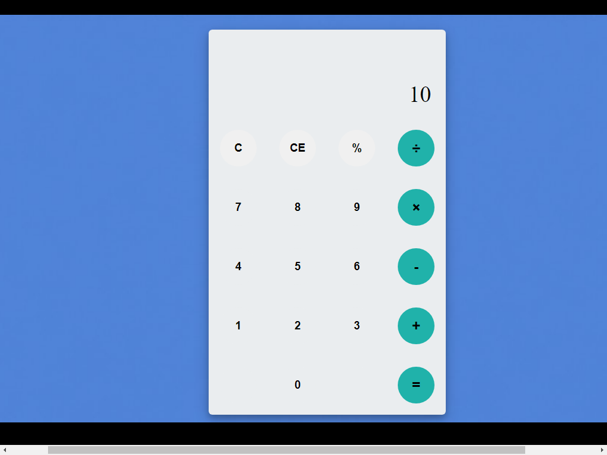

# A simple javascript calculator

-----------------------------------

### the was built by **Ibraheem Omikunle**.


## See the code below

```js
function getHistory() {
    return document.getElementById("history-value").innerText;
}

function printHistory(num) {
    document.getElementById("history-value").innerText = num;
}

function getOutput() {
    return document.getElementById("output-value").innerText;
}

function printOutput(num) {
    if(num == "") {
        document.getElementById("output-value").innerText = num;
    } else {
    document.getElementById("output-value").innerText = getFormattedNumber(num);
    }
}

function getFormattedNumber(num) {
    if (num == "-") {
        return "";
    }
    var n = Number(num);
    var valueOfNumber = n.toLocaleString("en");
    return valueOfNumber;
}

function reverseNumberFormat(num) {
    return Number(num.replace(/,/g,''));
}
var operator = document.getElementsByClassName("operator");
for (var i = 0; i < operator.length; i++) {
    operator[i].addEventListener('click', function() {
        if(this.id == "clear") {
            printHistory("");
            printOutput("");
        }
        else if (this.id == "backspace") {
            var output = reverseNumberFormat(getOutput()).toString();
            if(output){
                output = output.substr(0, output.length-1);
                printOutput(output);
            }
        }

        else {
            var output = getOutput();
            var history = getHistory();
            if (output == "" && history != "") {
                if(isNaN(history[history.length-1]))
                    history = history.substr(0, history.length-1);
            }

            if(output != "" || history != "") {
                output = output == ""? 
                output: reverseNumberFormat(output);
                history = history + output;
                if(this.id == "=") {
                    var result = eval(history);
                    printOutput(result);
                    printHistory("");
                }
                else {
                    history = history + this.id;
                    printHistory(history);
                    printOutput("");
                }
            }
        }
        // alert("The operator clicked:" + " " + this.id);
    });
}
var number = document.getElementsByClassName("number");
for (var i = 0; i < number.length; i++) {
    number[i].addEventListener('click', function() {
        var output = reverseNumberFormat(getOutput());
        // alert("The operator clicked:" + " " + this.id);
        if(output != NaN) {
            output = output + this.id;
            printOutput(output);
        }
    });
}

```

#### Check the image below
##### To see the interface of the calculateor.
